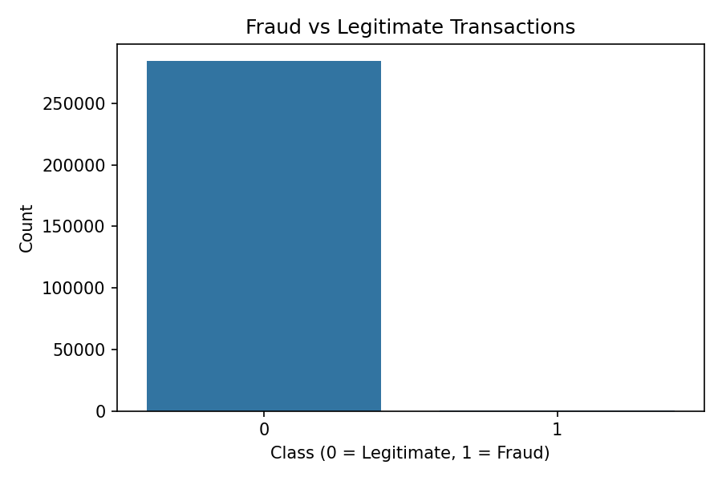
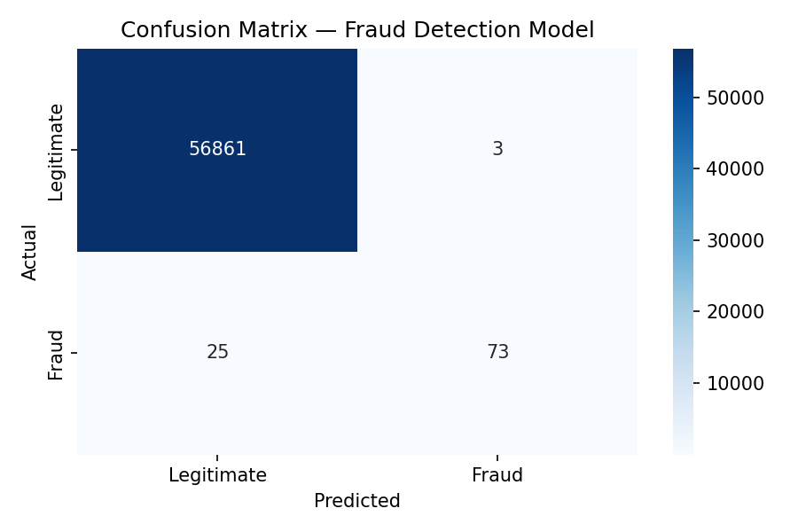

# Credit Card Fraud Detection 🔍

A machine learning project to detect fraudulent credit card transactions using Python and Random Forest classification.

---

## Project Overview

Financial fraud costs billions globally every year. This project builds a machine learning model trained on real-world credit card transaction data to automatically identify fraudulent activity — directly mirroring the work done by data scientists at major financial institutions.

---

## Dataset

- **Source:** [Kaggle Credit Card Fraud Detection Dataset](https://www.kaggle.com/datasets/mlg-ulb/creditcardfraud/data)
- **Size:** 284,807 transactions
- **Fraud cases:** 492 (0.17% of all transactions)
- **Features:** 30 anonymised features (V1–V28, Time, Amount) + Class label
- **Challenge:** Highly imbalanced dataset — a core real-world data science problem

---

## Tools & Technologies

- **Python** — core programming language
- **Pandas** — data loading and manipulation
- **NumPy** — numerical operations
- **Matplotlib & Seaborn** — data visualisation
- **Scikit-learn** — machine learning model (Random Forest)

---

## Project Steps

1. **Load & Explore** — loaded 284,807 rows, examined class distribution
2. **Visualise** — charted fraud vs legitimate transaction volumes
3. **Prepare Data** — split into 80% training / 20% testing sets
4. **Train Model** — Random Forest Classifier with 100 decision trees
5. **Evaluate** — assessed using precision, recall, F1-score and confusion matrix
6. **Visualise Results** — heatmap of confusion matrix

---

## Results

| Metric | Legitimate | Fraud |
|--------|-----------|-------|
| Precision | 1.00 | 0.94 |
| Recall | 1.00 | 0.82 |
| F1-Score | 1.00 | 0.87 |

**Confusion Matrix:**
- ✅ 56,859 legitimate transactions correctly identified
- ✅ 80 fraud cases correctly detected
- ⚠️ 18 fraud cases missed
- ⚠️ 5 false alarms

---

## Key Visualisations

### Fraud vs Legitimate Transactions

### Confusion Matrix

---

## About the Author

**Adaeze (Princess) Umahi**
Data Analyst | Medical Doctor (MBBS) | MPH — Epidemiology, Biostatistics & Data Science (University of Glasgow) 

SQL · Python · R · Power BI · Tableau · Microsoft Dynamics 365
Google Data Analytics Certified | Code First Girls & Data Camp — SQL, Python, AI & Machine Learning | Microsoft Power BI PL-300 (In Progress)
Building a portfolio at the intersection of health data, business intelligence and real-world analytical impact. 

- GitHub: [github.com/PrincessUmahi](https://github.com/PrincessUmahi)
