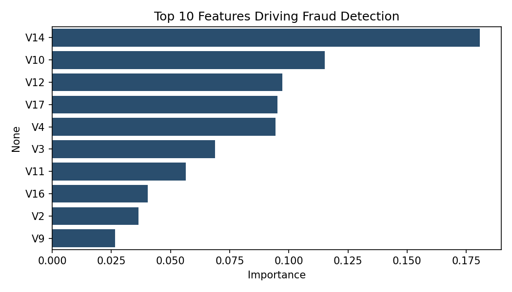
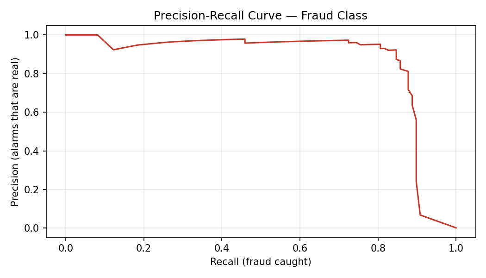

# Credit Card Fraud Detection 🔍

A machine learning project to detect fraudulent credit card transactions using Python and Random Forest classification — with a focus on the metrics that actually matter for imbalanced, real-world fraud data.

---

## Project Overview

Financial fraud costs billions globally every year. This project trains a machine learning model on real-world credit card transaction data to automatically identify fraudulent activity. The dataset is **highly imbalanced** (fraud is just 0.17% of transactions), which is the central modelling challenge and the reason this project focuses on **precision and recall for the fraud class — not accuracy.**

> **Why accuracy is the wrong metric here:** A model that simply labels *every* transaction "legitimate" would score 99.83% accuracy while catching zero fraud. Accuracy is meaningless on imbalanced data. This project is evaluated on how well it catches the rare fraud cases (recall) and how trustworthy its fraud alerts are (precision).

---

## Dataset

- **Source:** [Kaggle Credit Card Fraud Detection Dataset](https://www.kaggle.com/datasets/mlg-ulb/creditcardfraud/data)
- **Size:** 284,807 transactions
- **Fraud cases:** 492 (0.173% of all transactions)
- **Features:** 30 anonymised features (V1–V28, Time, Amount) + Class label
- **Challenge:** Severe class imbalance — a core real-world data science problem

---

## Tools & Technologies

- **Python** — core programming language
- **Pandas / NumPy** — data loading and manipulation
- **Matplotlib / Seaborn** — data visualisation
- **Scikit-learn** — machine learning model (Random Forest) and evaluation metrics

---

## Method

1. **Load & explore** — 284,807 rows; examined the 0.17% fraud rate
2. **Visualise** — charted the class imbalance
3. **Prepare** — 80/20 train/test split, **stratified** to preserve the fraud ratio in both sets
4. **Train two models** — a baseline Random Forest and a `class_weight='balanced'` version, to test whether re-weighting the rare class improves fraud capture
5. **Evaluate** — precision, recall, F1, confusion matrix, ROC-AUC and PR-AUC
6. **Interpret** — feature importance and a precision-recall curve for threshold analysis

---

## Results

Performance on the held-out test set (56,962 transactions, 98 real frauds):

| Metric (fraud class) | Baseline | Class-weighted |
|---|---|---|
| Precision | 0.941 | 0.961 |
| Recall | 0.816 | 0.745 |
| F1-score | 0.874 | 0.839 |
| Frauds caught (of 98) | 80 | 73 |
| Frauds missed | 18 | 25 |
| False alarms | 5 | 3 |

**Overall model quality (baseline):** ROC-AUC **0.95** · PR-AUC **0.86** — strong discrimination on a highly imbalanced dataset.

### Confusion Matrix (baseline)
- ✅ 56,859 legitimate transactions correctly identified
- ✅ 80 of 98 fraud cases correctly detected (81.6% recall)
- ⚠️ 18 fraud cases missed
- ⚠️ 5 false alarms

---

## Key Finding & Interpretation

I expected `class_weight='balanced'` to improve fraud detection. **It did not.** Re-weighting made the model more conservative: precision rose (0.941 → 0.961) and false alarms fell (5 → 3), but **recall dropped (0.816 → 0.745) — it caught 7 fewer real frauds.**

For fraud detection this is usually the *wrong* trade-off: a **missed fraud (false negative) costs real money**, whereas a **false alarm (false positive) only costs a customer a verification step.** I therefore retained the **baseline model**, which catches more fraud.

The more effective lever is **decision-threshold tuning**, not class weighting. The precision-recall curve shows that lowering the classification threshold below the default 0.5 would catch more fraud (higher recall) at the cost of more false alarms — a business decision a bank would make based on the relative cost of missed fraud vs customer friction.

---

## Feature Importance

The model's top predictors were **V14, V10, V12, V17 and V4**. These features (anonymised via PCA in the source data) carry the strongest fraud signal — useful for understanding *what drives* a prediction, even when the underlying variables are confidential.

---

## Key Visualisations

### Fraud vs Legitimate Transactions

### Confusion Matrix

### Feature Importance

### Precision-Recall Curve

---

## Limitations & Next Steps

- **Threshold tuning:** select an operating point on the PR curve based on the business cost ratio of missed fraud vs false alarms (the highest-impact next step).
- **Resampling:** test SMOTE or undersampling as alternative imbalance strategies and compare to class weighting.
- **Other algorithms:** benchmark against Logistic Regression (interpretable baseline) and XGBoost (often state-of-the-art on tabular fraud).
- **Temporal validation:** the data has a Time feature; a time-based split would better simulate detecting *future* fraud than a random split.

---

## About the Author

**Adaeze (Princess) Umahi**
Medical Doctor | Public Health Professional | Data Analyst

- MBBS, Donetsk National Medical University
- MSc Public Health (Epidemiology & Data Science), University of Glasgow
- Code First Girls — Data & SQL + Python (2026)
- DataCamp — Python, Data Engineering, Data Science, AI & Machine Learning (2025–2026)
- GitHub: [github.com/PrincessUmahi](https://github.com/PrincessUmahi)